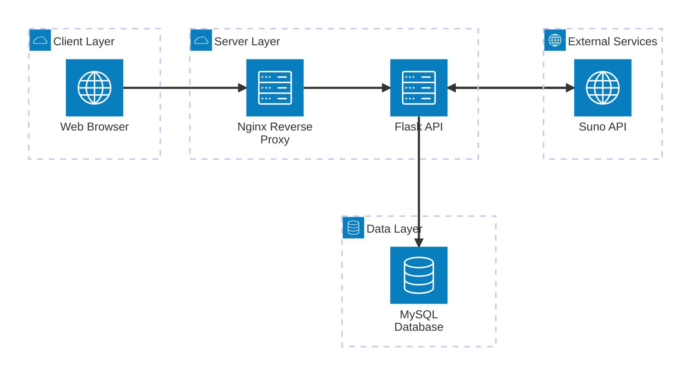

# AIAMusic Architecture Overview

## Overview

AIAMusic is a modern web-based platform for managing AI-powered music creation workflows. It replaces Excel-based music management with a professional, database-driven application that integrates with the Suno API for automated music generation. The platform supports team collaboration, style management, playlist organization, and provides a seamless workflow from song creation to completion with automatic downloads.

## Architecture Diagram



## Technology Stack

### Backend
- **Framework**: Flask 3.0 (Python 3.11)
- **Database**: MySQL 8.0 with SQLAlchemy ORM
- **Authentication**: Flask-JWT-Extended
- **Server**: Gunicorn + Nginx reverse proxy
- **API Integration**: Direct Suno API with webhooks
- **Serialization**: Flask-Marshmallow

### Frontend
- **Framework**: React 18
- **HTTP Client**: Axios
- **Routing**: React Router DOM
- **Build Tool**: Create React App
- **Styling**: Custom CSS (responsive design)

### Infrastructure
- **Hosting**: VPS with Docker containers
- **Web Server**: Nginx
- **Process Manager**: systemd/Gunicorn
- **SSL**: Let's Encrypt
- **Containerization**: Docker + Docker Compose
- **Reverse Proxy**: Nginx/Traefik

### External Integrations
- **Music Generation**: Suno API
- **Authentication**: JWT tokens (with Microsoft OAuth support)
- **File Storage**: Direct download URLs from Suno

## Core Components

### Frontend (React SPA)
Located in `frontend/` directory:
- **App.js**: Main application component with routing
- **Pages**: Login, HomePremium, ManageStyles, ManagePlaylists, MusicPlayer
- **Components**: Reusable UI components (SongCard, SongModal, StyleModal, etc.)
- **Services**: API integration layer (auth.js, songs.js, styles.js)
- **Theme**: Custom CSS theming system

Key Features:
- JWT-based authentication with OAuth support
- Song management with CRUD operations
- Style library management
- Playlist organization
- Real-time status updates
- Responsive design for desktop/mobile

### Backend (Flask API)
Located in `backend/app/` directory:
- **models.py**: SQLAlchemy models (User, Song, Style, Playlist)
- **routes/**: API endpoints organized by blueprint
  - `auth.py`: Authentication (login, register, OAuth)
  - `songs.py`: Song CRUD + Suno API integration
  - `styles.py`: Style management
  - `webhooks.py`: Suno callback handling
  - `playlists.py`: Playlist management
- **config.py**: Configuration management
- **run.py**: Application entry point

Key Features:
- RESTful API with JWT authentication
- Direct Suno API integration for music generation
- Webhook handling for async completion callbacks
- File download tracking
- Team collaboration support

### Database (MySQL)
Schema defined in `database/schema.sql`:
- **users**: User accounts with OAuth support
- **styles**: Reusable music style templates
- **songs**: Song tracking with status lifecycle
- **playlists**: Song organization with many-to-many relationships
- **playlist_songs**: Junction table for playlist ordering

Key Features:
- Status tracking: create → submitted → completed/failed
- Star ratings (1-5 stars)
- Download tracking for generated files
- Version control for song iterations

### Deployment & Infrastructure
- **Docker**: Containerized deployment with docker-compose.yml
- **Nginx**: Reverse proxy and static file serving
- **Gunicorn**: WSGI server for Flask
- **SSL**: HTTPS with Let's Encrypt certificates
- **Health Checks**: Built-in monitoring endpoints

## Key Workflows

### Song Creation Workflow
1. User creates song with title, lyrics, style, and vocal preferences
2. Frontend submits to `/api/v1/songs` (POST)
3. Backend validates and submits to Suno API
4. Song status changes to 'submitted'
5. Suno processes asynchronously
6. Suno sends webhook callback to `/api/v1/webhooks/suno-callback`
7. Backend updates song with download URLs and status 'completed'
8. Frontend polls for updates and shows download links

### Authentication Flow
- JWT token-based authentication
- Optional Microsoft OAuth integration
- Secure password hashing with bcrypt
- Token expiration and refresh handling

### Team Collaboration
- Multi-user support with ownership tracking
- Shared style library
- Public/private playlists
- User management and permissions

## API Overview

### Authentication Endpoints
- `POST /api/v1/auth/login` - User login
- `POST /api/v1/auth/register` - User registration
- `GET /api/v1/auth/me` - Current user info
- `GET /api/v1/auth/users` - List all users

### Song Management
- `GET /api/v1/songs` - List songs with filtering
- `POST /api/v1/songs` - Create new song
- `PUT /api/v1/songs/:id` - Update song
- `DELETE /api/v1/songs/:id` - Delete song
- `GET /api/v1/songs/stats` - Song statistics

### Style Management
- `GET /api/v1/styles` - List all styles
- `POST /api/v1/styles` - Create style
- `PUT /api/v1/styles/:id` - Update style
- `DELETE /api/v1/styles/:id` - Delete style

### Playlist Management
- `GET /api/v1/playlists` - List playlists
- `POST /api/v1/playlists` - Create playlist
- `PUT /api/v1/playlists/:id` - Update playlist
- `DELETE /api/v1/playlists/:id` - Delete playlist
- `POST /api/v1/playlists/:id/songs` - Add songs to playlist

### Webhooks
- `POST /api/v1/webhooks/suno-callback` - Suno completion callback

## Security Considerations

### Authentication & Authorization
- JWT tokens with configurable expiration
- Password hashing with bcrypt
- CORS configuration for allowed origins
- OAuth integration for enterprise authentication

### Data Protection
- HTTPS required for all communications
- Secure environment variable management
- No secrets committed to version control
- Input validation and sanitization

### API Security
- Rate limiting considerations (handled by Suno API)
- Request validation with Marshmallow schemas
- SQL injection prevention with SQLAlchemy ORM

## Getting Started for Code Reviewers

### Prerequisites
- Python 3.11+
- Node.js 16+
- MySQL 8.0+
- Docker (optional, for containerized deployment)

### Quick Setup for Review
1. **Clone the repository**
   ```bash
   git clone <repository-url>
   cd AIAMusic
   ```

2. **Review Project Structure**
   - `README.md`: High-level overview
   - `PROJECT_SUMMARY.md`: Detailed project history and features
   - `docs/`: Documentation including API specs and deployment guides

3. **Backend Review**
   - Start with `backend/app/__init__.py` (app factory)
   - Review models in `backend/app/models.py`
   - Examine routes in `backend/app/routes/`
   - Check configuration in `backend/config.py`

4. **Frontend Review**
   - Main app in `frontend/src/App.js`
   - Page components in `frontend/src/pages/`
   - Reusable components in `frontend/src/components/`
   - API services in `frontend/src/services/`

5. **Database Review**
   - Schema in `database/schema.sql`
   - Migration files in `database/migrations/`

6. **Deployment Review**
   - Docker setup in `docker-compose.yml` and `Dockerfile`
   - Nginx configuration in `deploy/nginx/`
   - Deployment scripts in `deploy/`

### Key Files for Understanding the System
- `backend/app/routes/songs.py`: Core business logic for song management
- `frontend/src/pages/HomePremium.js`: Main UI for song management
- `database/schema.sql`: Data model relationships
- `docker-compose.yml`: Infrastructure orchestration

### Testing the Application
- Use Docker deployment for quickest setup (see `DOCKER_DEPLOYMENT_CHECKLIST.md`)
- Or follow direct installation in `DEPLOYMENT_CHECKLIST.md`
- Requires Suno API key for full functionality

This architecture provides a scalable, maintainable solution for AI-powered music creation workflows with strong separation of concerns and modern web development practices.